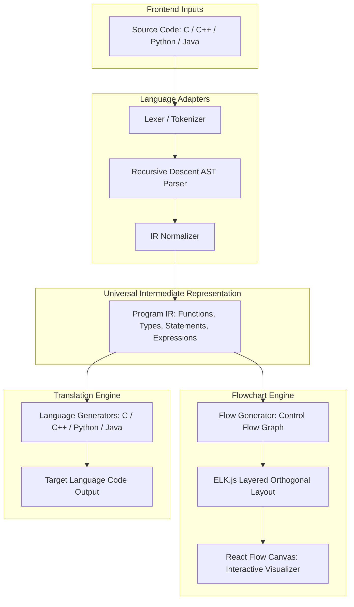

# FlowShift: Client-Side Interactive Flowchart Generator & Code Translator

**FlowShift** is a high-performance, client-side educational developer tool. It performs two core capabilities locally in the browser with **zero backend dependencies**:

1. **Interactive Flowchart Generation**: Converts source code into layered, orthogonal-routed flowcharts with syntax-level construct differentiation (Terminals, Processes, Input/Output, Decisions, Subroutines) and bidirectional source-to-diagram navigation.
2. **Cross-Language Program Translation**: Translates complete structured programs between **C, C++, Python, and Java** via a unified Intermediate Representation (IR).

---

## 1. Architectural Overview



---

## 2. Core Subsystems

### A. Universal Intermediate Representation (`src/core/ir/`)
- [program-ir.ts](../src/core/ir/program-ir.ts): Represents full compilation units with global statements, type definitions, and function declarations.
- [statement-ir.ts](../src/core/ir/statement-ir.ts): Strongly typed statements including variable declarations, assignments, `if`/`else` conditionals, `while`/`for` loops, function returns, breaks, continues, and I/O expressions.
- [expression-ir.ts](../src/core/ir/expression-ir.ts): Literals, identifiers, binary & unary operators, function calls, member accesses, and index accesses.
- [source-location.ts](../src/core/ir/source-location.ts): Full line/column ranges retained on all nodes for bidirectional editor ↔ flowchart highlighting.

### B. Flowchart Engine (`src/core/flow/`)
- [flow-generator.ts](../src/core/flow/flow-generator.ts): Traverses Statement IR to generate structured control flow nodes and labeled branches (`true`, `false`, `loop`, `next`).
- [flow-layout.ts](../src/core/flow/flow-layout.ts): Integrates **ELK.js** (`elkjs/lib/elk.bundled.js`) with hierarchical layered layout (`org.eclipse.elk.layered`), orthogonal edge routing, and node collision avoidance.
- **Custom React Flow Nodes**:
  - `TerminalNode`: Start/End function boundary pills with glowing accents.
  - `DecisionNode`: Rotated diamond polygon with top/bottom/lateral connection ports.
  - `ProcessNode`: Slate cards with construct badges and monospace labels.
  - `InputOutputNode`: Parallelogram geometry for `read`/`write`/`print` statements.
  - `SubroutineNode`: Double-bordered cards for function invocations.

### C. Language Adapters (`src/languages/`)
Each supported language implements a complete `LanguageAdapter` registered in the central `LanguageRegistry`:
- **C Adapter** (`src/languages/c/`): Handles includes, `printf`/`scanf`, standard types, loops, conditionals, and functions.
- **C++ Adapter** (`src/languages/cpp/`): Handles `std::cout`/`std::cin`, namespaces, and modern C++ constructs.
- **Python Adapter** (`src/languages/python/`): Handles Python indentation/dedentation tokens, dynamic typing, `print()`, `input()`, `elif`, and `for ... in range(...)`.
- **Java Adapter** (`src/languages/java/`): Handles class wrappers (`public class Main`), `public static void main`, `System.out.println`, and `Scanner`.

### D. Educational Sample Suite (`src/data/samples.ts`)
Pre-loaded algorithms available in all 4 languages:
1. **Odd or Even Classifier** (Conditional branching)
2. **Sum of First N Numbers** (`while` loop accumulator)
3. **Factorial Calculator** (Recursive function call & base case)
4. **Counting Sequence** (`for` loop with step counter)
5. **Grade Classifier** (Multi-branch `if`/`else if`/`else` ladder)

---

## 3. Automated Test Suite

All 6 test suites pass cleanly via Vitest:
- `tests/c-pipeline.test.ts`: C lexing, parsing, and normalization.
- `tests/cpp-pipeline.test.ts`: C++ stream I/O and loops.
- `tests/python-pipeline.test.ts`: Python indentation parsing and IR generation.
- `tests/java-pipeline.test.ts`: Java class structure and scanner extraction.
- `tests/cross-conversion.test.ts`: C -> Python, Python -> C, C -> Java cross-compilation.
- `tests/flowchart.test.ts`: Flowchart graph nodes, branch labels, and layout coordinates.

```bash
✓ tests/cpp-pipeline.test.ts (1 test)
✓ tests/c-pipeline.test.ts (2 tests)
✓ tests/java-pipeline.test.ts (1 test)
✓ tests/python-pipeline.test.ts (2 tests)
✓ tests/cross-conversion.test.ts (2 tests)
✓ tests/flowchart.test.ts (1 test)

Test Files  6 passed (6)
     Tests  9 passed (9)
```

---

## 4. Browser Verification

Interactive browser testing verified:
- **Zero Console Errors**: Clean execution on client-side bundle.
- **Monaco Code Editor**: Syntax highlighted, responsive, bidirectional line highlighting.
- **Flowchart Canvas**: Smooth panning, zooming, layout direction toggling (Vertical / Horizontal), and automatic mini-map.
- **Node Inspector Drawer**: Live inspection of statement kind, source range, and code label on node click.
- **Instant Translation**: Switching to Python and Java outputs idiomatic target code in real time.
